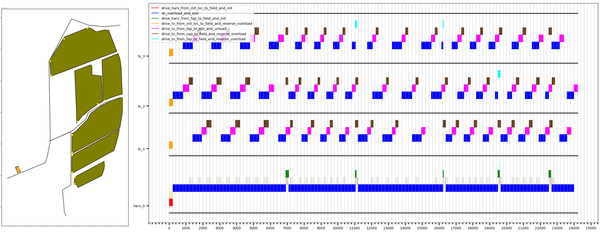

# AIPlan4EU - Agriculture use-case

[[_TOC_]]


## Overview


### Case description

This use-case deals with the planning of silage-maize harvesting campaigns. During silage-maize harvest, a non-capacitated harvester harvests the yield from a field. Because these machines have no bunker, one or more transport vehicles are used to receive the harvested yield from the harvester while the harvester is working (i.e., 'on the run' yield overload). The harvested yield is later transported to a silo for storage. In a day campaign, n fields (n>0) must be harvested by m harvesters (n>=m>0) being assisted by k transport vehicles (k>0). 


The process can be analyzed from the perspective of the harvesters and the transport vehicles.

* #### Harvester:

  * An unharvested field is assigned to a harvester. 

  * The harvester drives to the one of the access-points of the assigned field

  * The harvester waits for a transport vehicle to start harvesting and overloading the yield until the transport vehicle is full or the field is fully harvested

  * If the transport vehicle got full and the field is not fully harvested, the harvester will wait until a transport vehicle arrives to continue with the harvest; otherwise, the field is fully harvested, hence the harvester will exit the field via one of the access-points and wait for another field to be assigned to it (if any)

    

    

    

* #### Transport vehicle (TV):

  A transport vehicle can do two things: a) drive to a field to assist a harvester (only if the transport vehicle is not full and the harvester still needs assistance to complete the field); or b) drive to a silo and unload the yield (only if there is yield in its bunker to be unloaded)

  **a) Assist harvester (overload)**

  * The TV drives to one of the access-points of the corresponding field
  * The TV drives to the location (inside the field) where its overloading window will start and, if needed, waits for the harvester to start overloading
  * The TV drives behind/along-side the harvester while the harvester harvests and overloads the yield into the TV's bunker.
  * Once the TV is full or the field is fully harvested, the TV exits the field via one of the access-points. 
  * If the TV is full, it will have to drive to a silo to unload the yield; otherwise, it can either drive to a silo to unload the yield or go assist a harvester.

  **b) Unload at silo**

  * The TV drives to a silo access (unloading) point (SAP). The silo must have enough overall capacity to receive/store the yield in the TV's bunker.
  * Wait (near the SAP) until the SAP is available and has enough capacity for the TV to unload all the yield in its bunker.
  * The TV unloads the yield at the SAP
  * The TV is free to assist a harvester with an empty bunker

  

  

  

At the moment, a simplified version of the process at the silo is considered. In this simplified version, the yield unloaded at the silo's access/unloading points (SAPs) is immediately transfered into the general silo storage location. The silo's SAPs have infinite capacity, and they can be used by several transport vehicles simultaneously. In the more complex version, each SAP has a capacity and can only be used by one TV at a time. The yield unloaded in a silo's SAP is transfered to the silo's (main) storage area by one or more compaction vehicles assigned to the silo. These compactors can sweep a certain amount of yield in each tour, hence restoring the SAPs capacity so that other TVs can unload there in the future. 

* #### Compactor:

  * Wait until a silo access/unloading point (with yield) is assigned to it. 
  * Sweep the SAP, transferring yield from the SAP to the silo storage location. 
  * After the sweep, the compactor is free to be used to sweep a SAP. 

  

### Goal

The goal of this use-case is to plan the harvesting of the given fields with the given resources (harvesters, transport vehicles, silos) in a way that the campaign duration is minimized. The planning must consider the capacity constraints of the problem (i.e., the amount of yield in the fields and the capacities of the silos and TVs bunkers), the synchronization between harvesters and TVs during harvesting and overloading, and the duration of the different activities (transit outside the field between locations, transit inside of the fields, harvesting/overloading, unloading at the silo). At the end of the campaign, all fields must be harvested, and all the yield must be located at the silos.

Because the problem for a campaign is defined based on some estimations and assumptions (e.g., average yield mass in the fields [t/ha], constant/fixed machine transit speed and harvester working speeds, etc.), significant deviations to these values could render the generated plan obsolete after some time during the actual harvesting campaign. This is also be caused when the actual execution deviates from the plan, e.g., if a TV takes a longer path to the silo; a TV selects another silo to unload or harvester to assist; a machine has a failure and has to be removed or exchanged; there was a lunch break. Hence, the planning problem must support planning on started/incomplete campaigns, based on the current field, machines and silos states. 


## Unified Planning (UP)


The python implementation can be found in the [up_tsb_agriculture](up_tsb_agriculture) directory.


### Modeling

Given the required synchronization between machines and the time-dependent conditions and effects, the silage maize harvest represents a temporal planning problem. However, some adjustments were made to the problem definition to also represent the problem as a sequential planning problem  (with some limitations), by internally managing action durations, synchronization conditions, and computed timestamps via fluents. Therefore, two versions were developed, one for temporal planning and one for sequential planning. 

To synchronize the tasks performed by the machines (e.g., drive a TV to a field and wait for the respective overload activity, harvest the field while overloading from a harvester to the assigned transport vehicle, drive the TV to a silo and download), `DurativeActions` were used in the temporal problems, where the durations of such actions are either fixed or computed based on the current fluent values (e.g., current location of the machine, machine speed, and transit distance to the goal location for driving-related actions; current amount of yield in the TV bunker and TV unloading rate for unload-related actions; etc.). In the case of sequential planning, the problem actions were modified and decoupled, using `InstantaneousActions` together with extra control fluents to manage the synchronization and action durations internally.  It is important to note that not only the actions differ between the temporal and sequential planning approaches, but also the fluents used: some fluents are used in both approaches, whereas others are specific to the planning type. The action definitions for temporal and sequential planning can be found [here](up_tsb_agriculture/up_interface/actions/temporal) and [here](up_tsb_agriculture/up_interface/actions/sequential), respectivelly.

The management of resources (availability, capacity constraints, etc) are managed using boolean, numeric and `UserType` fluents. Boolean and numeric fluents are used to keep track of constant values (e.g., distance between locations, TV total bunker capacities) and object states (e.g., current TV bunker mass, yield mass remaining at the field, whether the field is completely harvested). The following `UserTypes` were introduced: `Harvester`, `TransportVehicle`, `Field`, `FieldAccess`, `Silo`, `SiloAccess`, `MachineInitLoc`, and `Compactor` (not used at the moment). These user types are used thoughout the planning process to keep track of facts such as whether a machine is at a specific location (`Field`, `FieldAccess`, `SiloAccess`, `MachineInitLoc`), or which harvester has been assigned to a field.

Moreover, intermediate effects were used in the temporal planning approach to specify important events within actions composed by more than one task. For example, an action `do_overload_and_exit` is composed by the TV tasks 'harvest and overload' and 'exit the field when the overload is finished', hence there will be an intermediate event 'overload finished' within the duration of the action, which enables the next TV to start to overload before the current TV reaches the field exit. Other intermediate effects are presented in the form of optional control windows, to ensure the an action is planned as soon as it is possible. For instance, once a TV has finished overloading, is full, and is located at a field exit, it is not desired that it remains idle at that location, but that is drives immediately to unload at a silo. To control this, a `do_overload_and_exit` action will enable a control fluent (`tv_enabled_to_drive`) at the timing when the TV reaches the field exit (`EndTiming - ɛ`), and disable it at `EndTiming`. Adding said control fluent as a condition to action `drive_tv_from_fap_to_silo_and_unload` will ensure that the planner will be able to plan the drive action only within the specified window (`ɛ`).

Finally, custom heuristics were developed to improve the planning times and the quality of the resulting plans, and are specific to the planning approach. By using custom heuristics it is possible to influence the actions selected by the planning engine, for instance, by selecting actions that decrease the amount of unharvested yield and/or increase the amount of yield stored in the silos. Additionally, for temporal planning, it is also possible to add cost-windows similar to the aforementioned control windows, which will enable to add extra costs in the heuristic functions for actions that are not planned timely. For example, if a TV arrives to the field and it is waiting to overload, and the overload from the harvester does not start within a given time (ɛ seconds after the TV arrives to the overloading start location), a penalty cost is added to the costs returned by the heuristic function. This will, for instance, make the planner send a TV to assist a harvester that is waiting to overload instead of sending it to assist a harvester that has already a queue of TVS waiting to overload.

The TSB provides a group of settings (defined [here](up_tsb_agriculture/up_interface/config.py)) that allows the user to control some aspects of the problem definition. The main settings correspond to the problem type (either temporal or sequential), and the types of the effects that will be added to the actions. The aforementioned control and error windows can also be enabled/disabled and configured via the problem settings. Thanks to these settings, more types of engines can be used to solve the problem.

Additionally, it is possible to pre-assign fields to the harvesters, as well as the order in which the fields must be harvested. Likewise, it is possible to pre-assign TVs to the harvesters as well as the order in which the TVs will overload from the harvester. These pre-assignments are done before planning and the corresponding restrictions are included in the problem definition. 


#### UP Features


The following table shows some of the main UP features used by both planning approaches.

| Feature                                                      | Temporal planning | Sequential planning |
| ------------------------------------------------------------ | ----------------- | ------------------- |
| ***General***                                                |                   |                     |
| PROBLEM_CLASS                                                | ACTION_BASED      | ACTION_BASED        |
| Action type                                                  | DurativeAction    | InstantaneousAction |
| Plan type                                                    | TimeTriggeredPlan | SequentialPlan      |
| ***Fluents and numbers***                                    |                   |                     |
| NUMERIC_FLUENTS, OBJECT_FLUENTS                              | X                 | X                   |
| CONTINUOUS_NUMBERS, DISCRETE_NUMBERS                         | X                 | X                   |
| BOUNDED_TYPES                                                | [optional]        | [optional]          |
| ***Effects***                                                |                   |                     |
| Normal effects (FLUENTS_IN_BOOLEAN_ASSIGNMENTS, FLUENTS_IN_NUMERIC_ASSIGNMENTS) | [optional] (1)    | [optional] (1)      |
| SIMULATED_EFFECTS                                            | [optional] (1)    | [optional] (1)      |
| CONDITIONAL_EFFECTS                                          | [optional] (1)    | [optional] (1)      |
| ***Conditions***                                             |                   |                     |
| DISJUNCTIVE_CONDITIONS, EQUALITIES, NEGATIVE_CONDITIONS      | X                 | X                   |
| ***Time and duration***                                      |                   |                     |
| TIMED_GOALS, TIMED_EFFECTS                                   | X                 |                     |
| INTERMEDIATE_CONDITIONS_AND_EFFECTS                          | X                 |                     |
| CONTINUOUS_TIME                                              | X                 |                     |
| STATIC_FLUENTS_IN_DURATIONS, FLUENTS_IN_DURATIONS            | X                 |                     |
| ***Quality metrics***                                        |                   |                     |
| MAKESPAN                                                     | [optional] (2)    |                     |
| FINAL_VALUE (MinimizeExpressionOnFinalState)                 |                   | [optional] (2)      |

**Notes:**

1) The following options are available to add the problem action effects (see [config.py](up_tsb_agriculture/up_interface/config.py#L10)): 
   * WITH_ONLY_SIM_EFFECTS (default): All effects are simulated effects
   * WITH_ONLY_NORMAL_EFFECTS: All effects are normal effects (no simulated nor conditional effects)
   * WITH_NORMAL_EFFECTS_AND_SIM_EFFECTS: If a normal effect is given with a proper value, this effect will be used for the respective fluent; otherwise the value for the fluent must be set via simulated effects.
   * WITH_ONLY_SIM_EFFECTS_WHERE_NEEDED: If all effects at a certain timing can be done without simulated effects or conditional effects, normal effects will be used; otherwise, all effects of that timing will be simulated effects.
   * WITH_NORMAL_EFFECTS_AND_CONDITIONAL_EFFECTS: Only normal and conditional effects will be used (no engines that supports the other features also support conditional effects, hence it was not tested)
2) No engines that supports the other features also support quality metrics, hence it was not tested.


## Components


The main components developed for this use-case are presented in the following table:

| Component                                                    | Description                                                  |
| ------------------------------------------------------------ | ------------------------------------------------------------ |
| [Data manager](up_tsb_agriculture/management/global_data_manager.py) | Used to register and access the objects of the harvesting campaign (fields, machines, silos, etc.) and their parameters. |
| [File IO components](up_tsb_agriculture/file_io/json)        | Used to read and write files containing the properties of the objects in the harvesting campaign (fields, machines, silos, etc.) and their current states. |
| [Fluents manager](up_tsb_agriculture/up_interface/fluents.py) | Manages the UP problem fluents, including fluents’ creation and addition to the problem. |
| [Effects handler](up_tsb_agriculture/up_interface/actions/actions_helper.py#L206) | Used to manage the way in which the effects will be added to the problem actions based on the given problem settings. |
| [Problem encoder](up_tsb_agriculture/up_interface/problem_encoder/problem_encoder.py) | Creates the UP problem based on the available data in the data manager, the current states of the fields and machines, and the problem settings provided by the user. |
| [Orchestrator](up_tsb_agriculture/up_interface/orchestrator.py) | Uses a problem encoder to generate a UP problem and generates a UP plan based on the given planning settings. |
| Heuristics factories for [temporal](up_tsb_agriculture/up_interface/heuristics/heuristics_factory.py#L389) and [sequential](up_tsb_agriculture/up_interface/heuristics/heuristics_factory.py#L79) planning | These factories offer a group of predefined custom heuristics that can be used for temporal and sequential planning. |
| [Sequential-plan  generator](up_tsb_agriculture/pre_processing/sequential_plan_generator.py) | Generates a valid plan for a sequential-planning problem, without using UP-planners, by assigning fields and transport vehicles to the harvesters (and their turns) and applying the corresponding actions. The resulting plan can be used to assess the quality of the plans generated by the UP planners, and to include it in the definition of custom heuristics to reject plans that have lower quality (e.g., by limiting the allowed plan duration). |
| [Temporal-](up_tsb_agriculture/post_processing/temporal_plan_decoder.py) and [sequential-](up_tsb_agriculture/post_processing/sequential_plan_decoder.py) plan decoders | The plan decoders obtain information from the UP plans which is later used for analysis and simulation. A plan decoder is available for each of the supported planning types: sequential and temporal. |
| Basic [Temporal-](up_tsb_agriculture/visualization/temporal_plan_plotter.py) and [sequential-](up_tsb_agriculture/visualization/sequential_plan_plotter.py) plan  plotters | These components are used to display the actions (and their durations) related to each of the machines participating in the process. |
| [Plan simulator](up_tsb_agriculture/visualization/plan_simulation_1.py) | Used to simulate and display the states of the problem objects (fields, machines, etc.) for a given UP plan (or a decoded plan of a plan decoder) in the temporal domain. The simulator can be used to obtain the field and machine states at a given timestamp, which can be used to test re-planning. |
| [Out-field route planner](up_tsb_agriculture/route_planning/outfield_route_planning.py) | A simple version of a planner used to generate machine routes/paths for transit between locations (fields, silos, machine initial locations) based on some predefined roads. |
| [Field route planner](up_tsb_agriculture/route_planning/field_route_planning.py) | This component acts as an interface to the Arolib field geometry processing and infield route planning functionalities. |
| [Field partial plan  manager](up_tsb_agriculture/management/field_partial_plan_manager.py) | Used to generate partial field plans via the Field route planner component, corresponding to the route planning of a single overload on partially harvested fields. At the moment, it is not used in the planning process, but only in posterior analysis. |
| [Arolib plan generator](up_tsb_agriculture/post_processing/arolib_plan_generator.py) | Reads a decoded UP plan and generates an Arolib plan (i.e., machine routes) based on it, which includes the corresponding infield route planning via the Field partial plan manager. It also acts as a UP plan decoder, so that the plan simulator can use it. |


## Examples


Two different types of examples are available: loading the campaign data from files; and automatically creating a basic 'fake' campaign. The provided example scripts [plan_campaign.py](up_tsb_agriculture/examples/plan_campaign.py) and [plan_fake_campaign.py](up_tsb_agriculture/examples/plan_fake_campaign.py) can be used as reference to understand how the overall planning process is run (load or create campaign data; set-up the planning and problem settings; use the Orchestrator to define the problem and plan; plot and simulate the plans, etc.).


### Campaign test data

Three different campaigns are available [here](test_data/campaigns):

- [campaign_1](test_data/campaigns/campaign_1): Complete campaign consisting of 6 fields, 1 harvester, 3 transport vehicles, and 1 silo.
- [campaign_2 (6711 s)](test_data/campaigns/campaign_2__6711s): Started campaign consisting of 5 fields, 1 harvester, 6 transport vehicles, and 1 silo. Here, one of the fields is partially harvested and currently being harvested by the harvester. These data correspond to the actual state of a campaign 6711 seconds (112 min) after it started.
- [campaign_3](test_data/campaigns/campaign_3): Complete campaign consisting of 8 fields, 2 harvester, 11 transport vehicles, and 1 silo. 

Additionally, data corresponding to started (incomplete) campaigns is also provided. These data was generated using plans to obtain the field, machine and silo states at a given point in time within the plan duration. For instance, [campaign_3_1H_6TV_state__2711s](test_data/campaigns/campaign_3_1H_6TV_state__2711s) corresponds to the state of `campaign_3` (limited to 1 harvester and 6 TVs) 2711 seconds after the plan started.


### Load campaign data and plan

The [plan_campaign](up_tsb_agriculture/examples/plan_campaign.py) script can be used to load data from a campaign path, define and plan the problem, and plot and simulate the resulting plan if desired. The path to the directory holding the campaign data and other settings can be specified directly using the call arguments. To have an overview of the available options run the script with the `-h` or `--help` option. 

```bash
python3 up_tsb_agriculture/examples/plan_campaign.py -h
```

For example, the following call will load campaign_1, plot the scene, define the problem as a temporal problem, plan the problem, plot the plan, and run the simulation. 

```bash
python3 up_tsb_agriculture/examples/plan_campaign.py --path test_data/campaigns/campaign_1 --plan_type temporal --plot_scene -pp2 -sim -sima
```





Alternatively, the script can be called giving the path of JSON file from which the example configuration can be loaded. For instance, the following call will load the configuration from file [campaign_1_\_seq__3F.json](test_data/example_configs/campaign_1__seq__3F.json), which will load `campaign_1`, limit the number of fields to 3, define the problem as a sequential problem, plan the problem, plot the plan, and run the simulation. 

```bash
python3 up_tsb_agriculture/examples/plan_campaign.py --config_file test_data/example_configs/campaign_1__seq__3F.json
```

The [plan_campaign_config_default.json](test_data/example_configs/plan_campaign_config_default.json) shows all available settings and can be used as reference. Note that if a setting is not set, the default value will be used.


### Create fake campaign data and plan

The  [plan_fake_campaign](up_tsb_agriculture/examples/plan_fake_campaign.py)  script can be used to create a simple campaign with *`f`* fields (`f > 0`), *`hv`* harvesters (`hv > 0`), *`tvs`* transport vehicles (`tvs > 0`), and *`s`* silos (`s = [1,2]`), with *`n`* access points per field (`n > 0`) and *`m`* access/unloading points per silo (`m > 0`). The silos will be located at the extrema of a horizontal road, and the fields will be located in either side of the road. Subsequently, it will define and plan the problem, and plot and simulate the resulting plan if desired. The desired number of fields, machines and silos, among other settings, can be specified directly using the call arguments. To have an overview of the available options run the script with the `-h` or `--help` option. 

```bash
python3 up_tsb_agriculture/examples/plan_fake_campaign.py -h
```

For example, the following call will create a campaign with 4 fields (2 access points per field), 1 harvester, 3 transport vehicles, and 1 silo (1 access/unloading point), and it will plot the scene, define the problem as a sequential problem, plan the problem, plot the plan and run the simulation. 

```bash
python3 up_tsb_agriculture/examples/plan_fake_campaign.py -f 4 -hv 1 -tvs 3 -s 1 -appf 2 -apps 1 --plan_type sequential --plot_scene -pp2 -sim -sima
```

Alternatively, the script can be called giving the path of JSON file from which the example configuration can be loaded. For instance, the following call will load the configuration from file [10F_1H_6TV_1S__temp.json](test_data/example_configs/10F_1H_6TV_1S__temp.json) and create a campaign with 10 fields (1 access points per field), 1 harvester, 6 transport vehicles, and 1 silo (1 access/unloading point). Subsequently, it will define the problem as a temporal problem, plan the problem, plot the plan, and run the simulation. 

```bash
python3 up_tsb_agriculture/examples/plan_campaign.py --config_file test_data/example_configs/10F_1H_6TV_1S__temp.json
```

The [plan_fake_campaign_config_default.json](test_data/example_configs/plan_fake_campaign_config_default.json) shows all available settings and can be used as reference. Note that if a setting is not set, the default value will be used.


## Funding information


This library is being developed for the AIPlan4EU H2020 project (https://aiplan4eu-project.eu) that is funded by the European Commission under grant agreement number 101016442.

The DFKI Niedersachsen (DFKI NI) is sponsored by the Ministry of Science and Culture of Lower Saxony and the VolkswagenStiftung.
